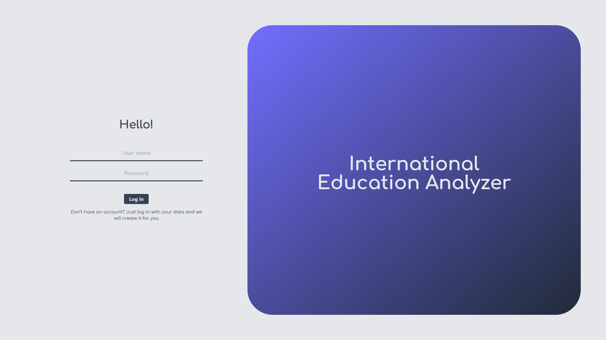
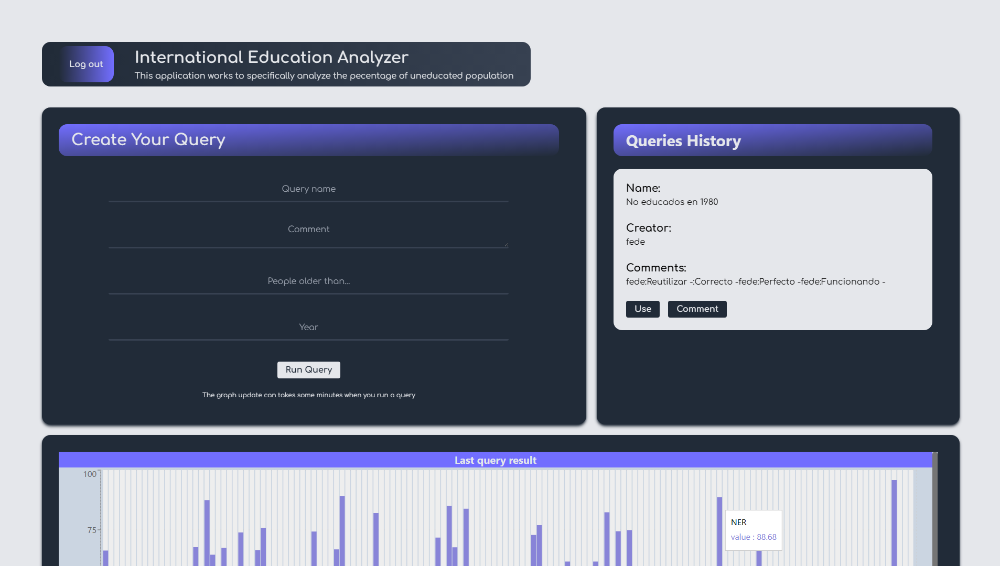
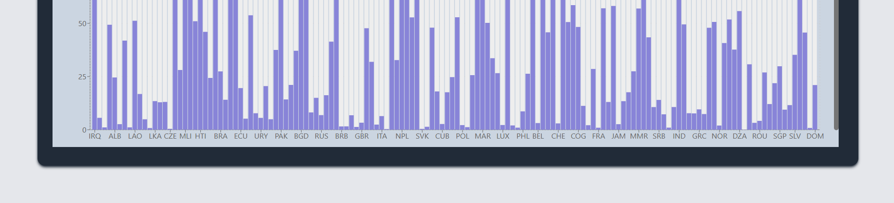
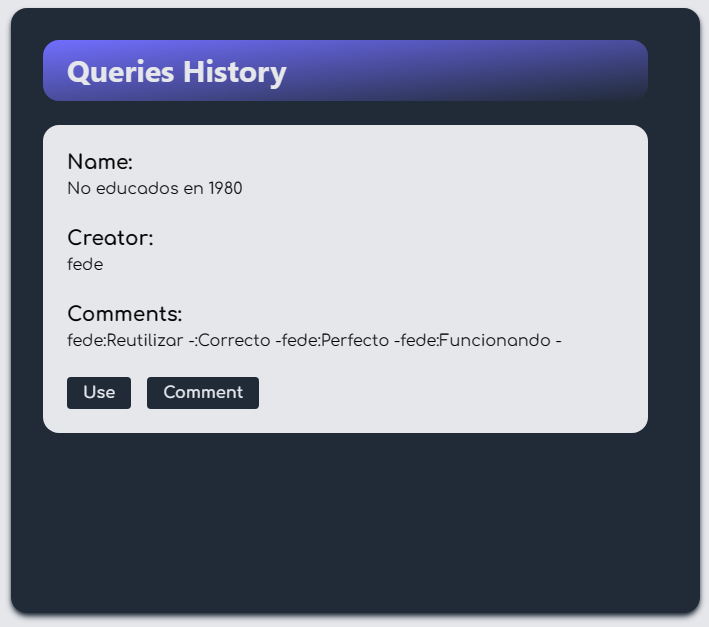

# International Education Analyzer

## 1. Log in

Hey analyzer! To use the application first, you need to login. Once you open the application you will see the following login form.

## 2. The analyzer

Later, you can see the analyzer dashboard that contains: the form where you can create a new query, a list of queries that were create or used befor and the graph that was create by the las query executed, note that there is not queies historical information yo will not see information in this components, but if you have, you will see something like the following:

As every query result will have many countries, the graph is interactive so you can place your pointer in each bar to see the specific its specific values.

## 3. Re use and comment a query

For each query in the query history two buttons: Use and Comment. The first button allows you to re use a query made before and the second button allows you to comment on the query.

## Have a good analyzing!
